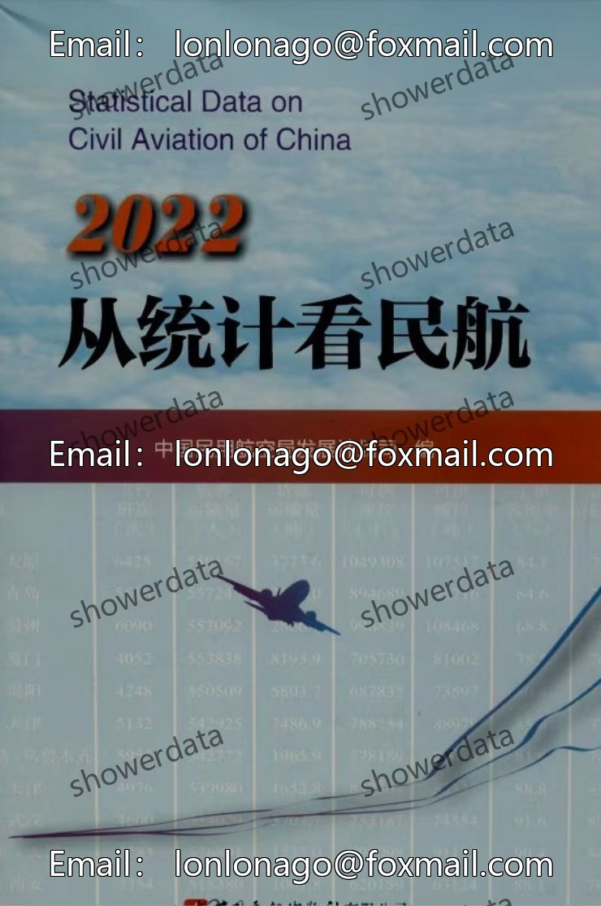
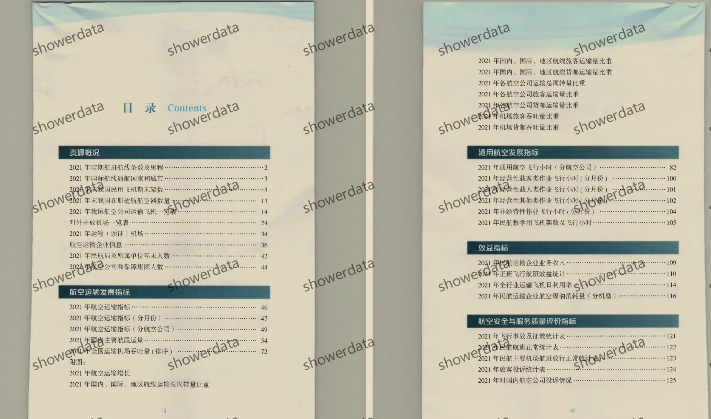
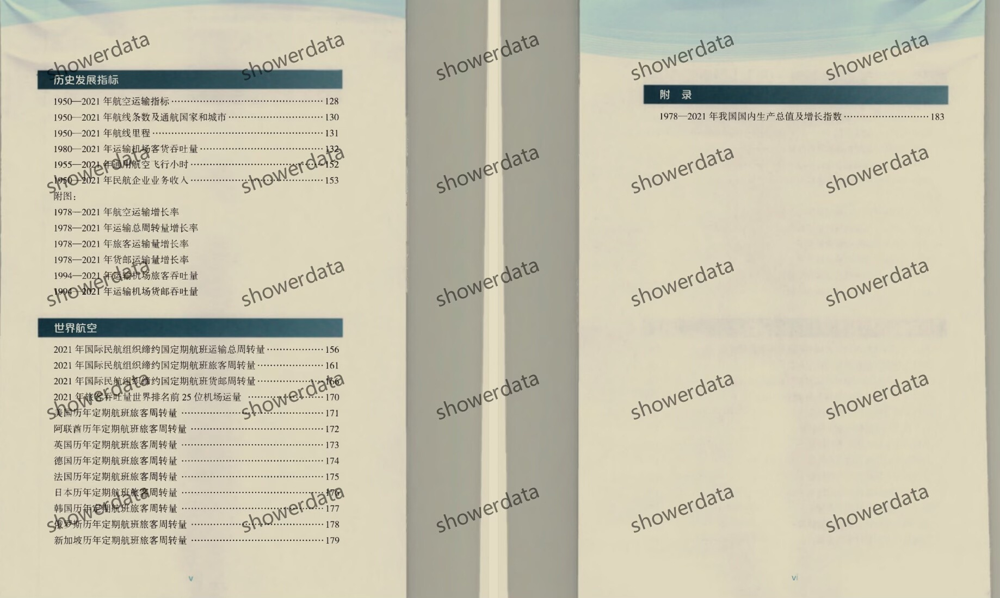
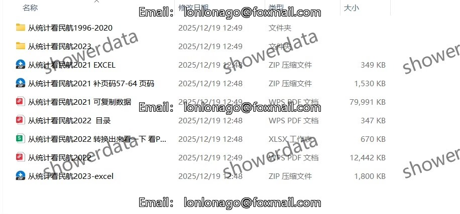

## Body

"From Statistics to Civil Aviation" Civil Aviation Statistical Data (1996-2023)

Data Year: The publication year of the data is from 1996 to 2023. (The data year needs to be subtracted by one before purchasing.) Please read the description below carefully before purchase! After shipping, there will be no returns or exchanges for any reason!

01. Data Introduction
"From Statistics to Civil Aviation"

02. Indicator Details
(1) The directory is displayed in the image, please take a look on your own and make an informed purchase. There are many indicators, so help me find them if you need them. I cannot assist with finding data without your request. All data is here, but after shipping, there will be no returns or exchanges for any reason.
(2) The display directory is for 2022, and the statistical口径 may change from year to year. Academic common sense, the data recorded in statistical materials is the data from the previous year, which is also a common sense in academia. Please be aware of this.
(3) The Excel format data is organized from original materials, including the content of the original data, but not the text content of the original material.
(4) If the data is placed in a zip file, you need to save it first, then download, and then unzip.
(5) If there is Excel protection, you can select all and copy to a new sheet to use.

03. Data Content
2023 Excel
2022 Excel, PDF (the Excel version is converted, which may not be accurate, so the PDF version is needed for accuracy)
2021 Excel, PDF
2020 PDF
2019, 2018 PDF, Excel (the Excel version is converted, which may not be accurate, so the PDF version is needed for accuracy)
2017 PDF, Browser Version
2016, 2010-2011 Excel
2012-2015, 2009-1996 PDF
Please read carefully before purchase! If you have any objections to the format, do not purchase!

## Images

item_1005707996737

Here is a pay link on Stripe ( https://buy.stripe.com/3cs8yP7sY87d0vu9AB ). Please contact me lonlonago@foxmail.com after funding $89, and I will send you a complete data files , thank you!

